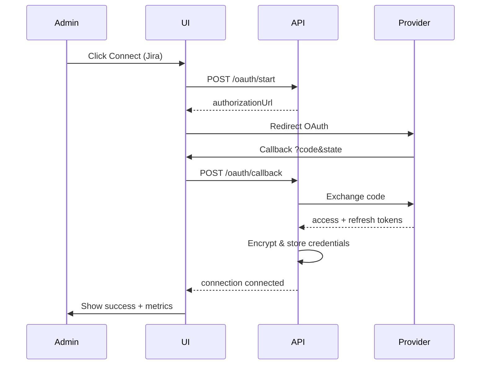
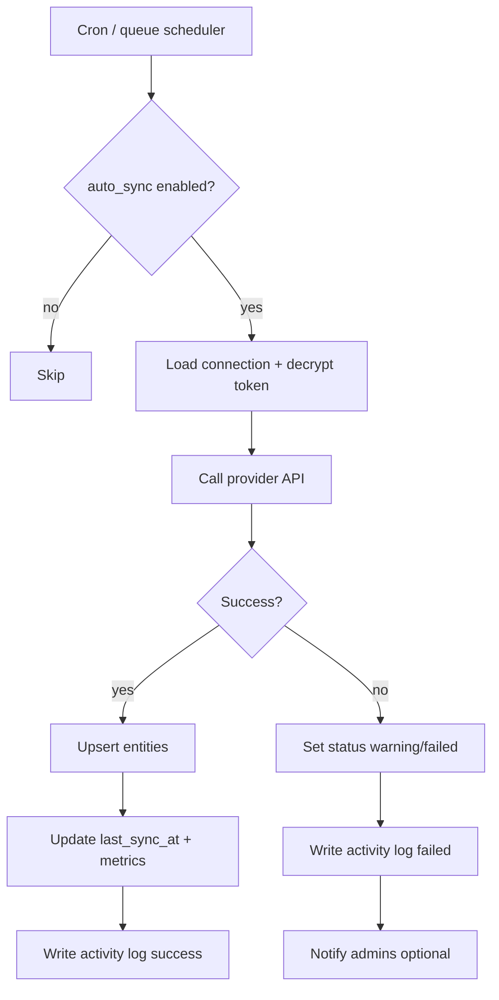
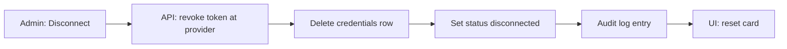
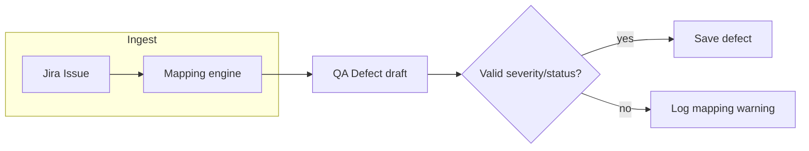
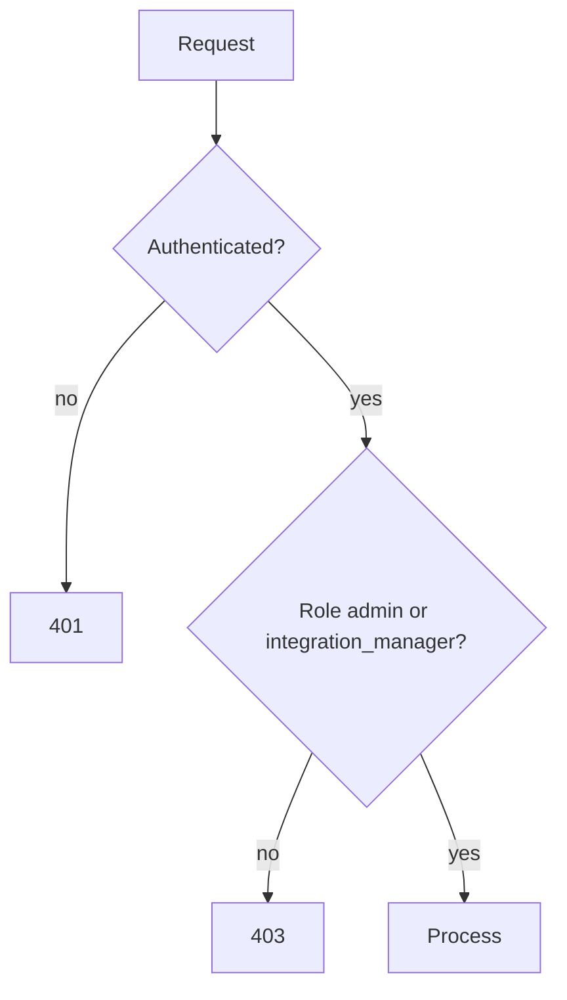

# Integration Workflow Diagrams

## OAuth connect flow

```mermaid
sequenceDiagram
  participant Admin
  participant UI
  participant API
  participant Provider

  Admin->>UI: Click Connect (Jira)
  UI->>API: POST /oauth/start
  API-->>UI: authorizationUrl
  UI->>Provider: Redirect OAuth
  Provider->>UI: Callback ?code&state
  UI->>API: POST /oauth/callback
  API->>Provider: Exchange code
  Provider-->>API: access + refresh tokens
  API->>API: Encrypt & store credentials
  API-->>UI: connection connected
  UI->>Admin: Show success + metrics
```

## Scheduled sync flow

```mermaid
flowchart TD
  A[Cron / queue scheduler] --> B{auto_sync enabled?}
  B -->|no| Z[Skip]
  B -->|yes| C[Load connection + decrypt token]
  C --> D[Call provider API]
  D --> E{Success?}
  E -->|yes| F[Upsert entities]
  F --> G[Update last_sync_at + metrics]
  G --> H[Write activity log success]
  E -->|no| I[Set status warning/failed]
  I --> J[Write activity log failed]
  J --> K[Notify admins optional]
```

## Disconnect flow

```mermaid
flowchart LR
  A[Admin: Disconnect] --> B[API: revoke token at provider]
  B --> C[Delete credentials row]
  C --> D[Set status disconnected]
  D --> E[Audit log entry]
  E --> F[UI: reset card]
```

## Jira defect mapping

```mermaid
flowchart LR
  subgraph Ingest
    J[Jira Issue] --> M[Mapping engine]
  end
  M --> D[QA Defect draft]
  D --> V{Valid severity/status?}
  V -->|yes| S[Save defect]
  V -->|no| L[Log mapping warning]
```

## Role check (mutations)

```mermaid
flowchart TD
  R[Request] --> A{Authenticated?}
  A -->|no| 401
  A -->|yes| B{Role admin or integration_manager?}
  B -->|no| 403
  B -->|yes| P[Process]
```
