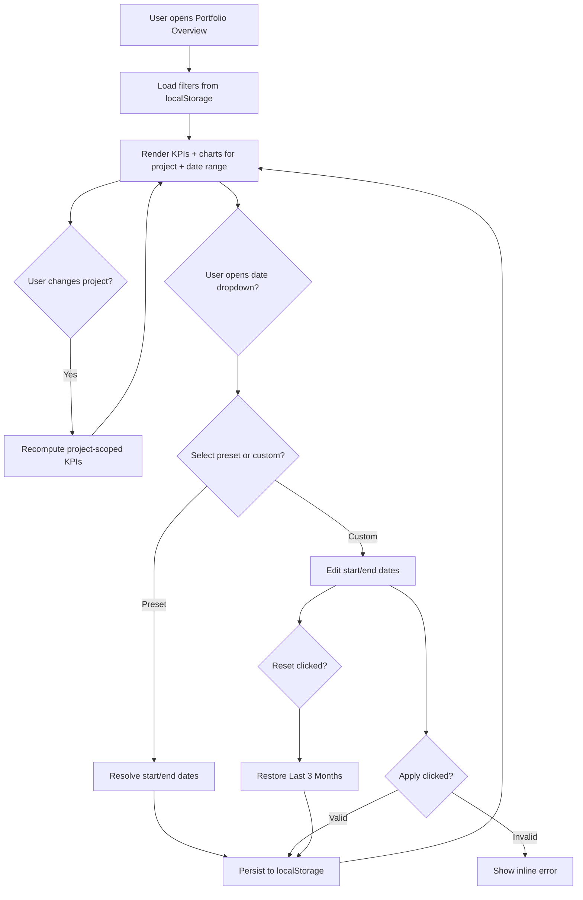

# Portfolio Overview — Date Range Filter

## 1. UI specification

### Header filter bar

Placement: top-right of **Portfolio Overview** (`PageHeader` action slot).

```text
Portfolio Overview
Real-time visibility into quality health…

[ All projects ▼ ]                    [ 📅 Last 3 Months ▼ ]
```

**Filters on this page**

| Filter | Included | Notes |
|--------|----------|-------|
| All Projects | Yes | Project-scoped portfolio metrics |
| Date Range | Yes | Calendar icon + selected label |
| Sprint | **No** | Not shown on Portfolio Overview |

### Date range dropdown

**Presets**

- Current Month
- Last Month
- Last 3 Months (default)
- Last 6 Months
- Last 12 Months
- Custom Date Range

**Custom range panel**

- Start Date (`type="date"`)
- End Date (`type="date"`)
- **Apply** — validates range and closes menu
- **Reset** — restores default (Last 3 Months)

**Trigger display**

- Lucide `Calendar` icon (brand color)
- Truncated label: preset name or `MMM D – MMM D` for custom

### Period context

Subtitle below header: `Showing data for {selected range}`.

### KPI rows (date- and project-aware)

**Row 1 — Portfolio status**

- Total Projects, Active Projects, Closed Projects, Portfolio Pass Rate

**Row 2 — Period metrics**

- Avg. Quality Score (from filtered quality trend)
- Defects Opened / Defects Closed (from filtered defect trend)
- Automation Coverage (project-scoped average)

### Charts

- Quality Score Trend — buckets filtered by `periodStart`
- Defect Activity — buckets filtered by `periodStart`
- Empty state when no buckets fall in range

---

## 2. Filter interaction flow



**Persistence**

- Key: `qa-intelligence-overview-filters-v1`
- Survives page refresh and navigation within the app
- Fields: `selectedProject`, `datePreset`, `customStart`, `customEnd`

---

## 3. Responsive behavior

| Breakpoint | Layout |
|------------|--------|
| Mobile (`<640px`) | Filters stack vertically, full width |
| Tablet (`≥640px`) | Filters in a row, right-aligned in header |
| Desktop (`≥1024px`) | Project filter left, date filter right within action group; KPI grid 4 columns |

**Touch / tablet**

- Dropdown min width 288px; date inputs use native pickers
- Click-outside closes date menu

---

## 4. API requirements

### Suggested endpoint

`GET /api/v1/workspaces/{workspaceId}/portfolio/overview`

**Query parameters**

| Param | Type | Description |
|-------|------|-------------|
| `projectId` | `string` | Optional; omit for all projects |
| `startDate` | `ISO date` | Inclusive range start |
| `endDate` | `ISO date` | Inclusive range end |

**Response**

```json
{
  "range": { "start": "2026-04-01", "end": "2026-06-30", "preset": "last_3_months" },
  "kpis": {
    "totalProjects": 8,
    "activeProjects": 5,
    "completedProjects": 1,
    "atRiskProjects": 2,
    "avgQualityScore": 80.7,
    "portfolioPassRate": 88.4,
    "automationCoverage": 69,
    "openedDefects": 466,
    "closedDefects": 475
  },
  "qualityScoreTrend": [{ "label": "Apr", "value": 80, "periodStart": "2026-04-01" }],
  "defectTrend": [{ "label": "Apr", "value": 134, "secondary": 158, "periodStart": "2026-04-01" }],
  "atRiskProjects": []
}
```

**Server rules**

- Filter trend buckets where `periodStart` ∈ `[startDate, endDate]`
- Scope project aggregates when `projectId` present
- Validate `startDate <= endDate`; return `400` otherwise

---

## 5. Acceptance criteria

### UI

- [ ] Sprint filter is **not** visible on Portfolio Overview
- [ ] All Projects filter appears in the header
- [ ] Date Range filter appears top-right with calendar icon and active label
- [ ] All six preset options plus custom range are available
- [ ] Custom range supports Apply and Reset with validation

### Behavior

- [ ] Changing project updates KPIs, at-risk list, and quick-link subtitles
- [ ] Changing date range updates KPIs, charts, and period subtitle
- [ ] Charts show empty state when no data exists in range
- [ ] Selected filters persist after refresh (localStorage)

### QA validation

- [ ] Default load shows **Last 3 Months** (Apr–Jun 2026 mock data)
- [ ] **Current Month** shows June buckets only
- [ ] **Custom** with start > end shows error and does not apply
- [ ] **Reset** returns to Last 3 Months
- [ ] Single-project filter reduces Total Projects to 1

### Engineering references

| Area | Path |
|------|------|
| Page | `src/pages/dashboard/OverviewPage.tsx` |
| Filters UI | `src/components/dashboard/OverviewFilters.tsx`, `DateRangeFilter.tsx` |
| Hook | `src/hooks/useOverviewFilters.ts` |
| Date logic | `src/lib/dateRangeFilter.ts` |
| KPI logic | `src/lib/overviewMetrics.ts` |
| Persistence | `src/lib/overviewFilterStorage.ts` |
